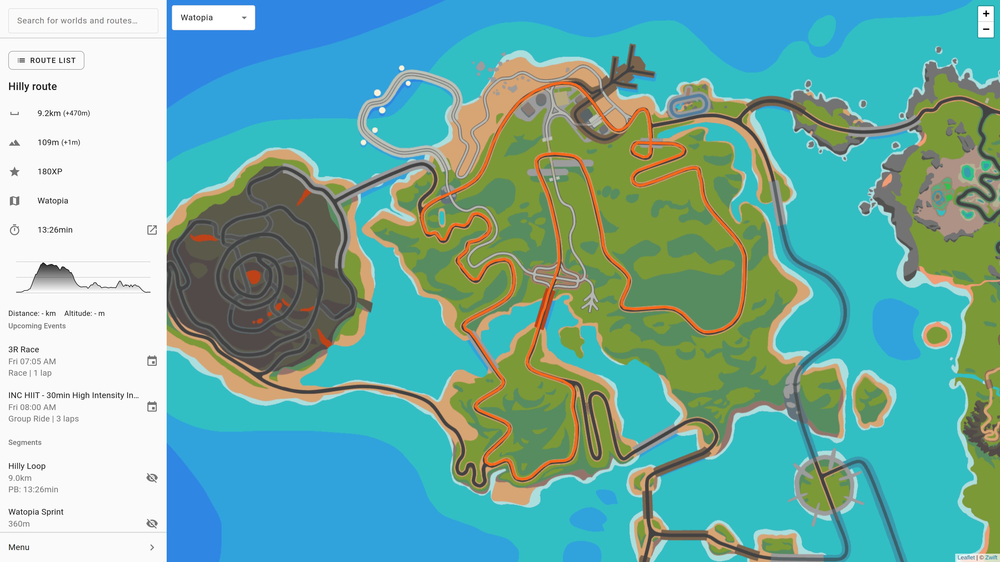
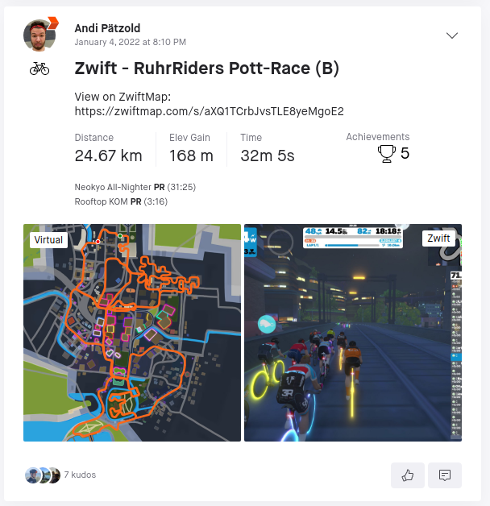
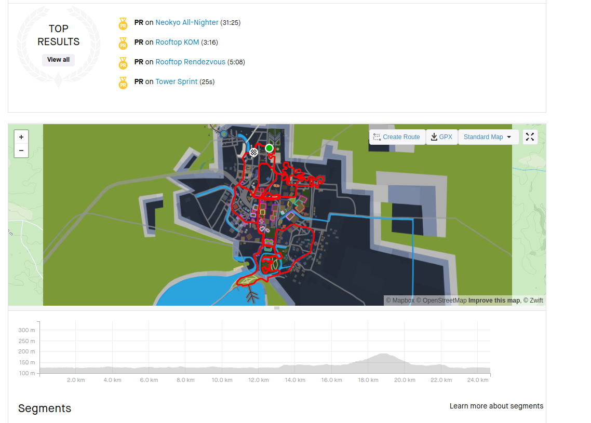
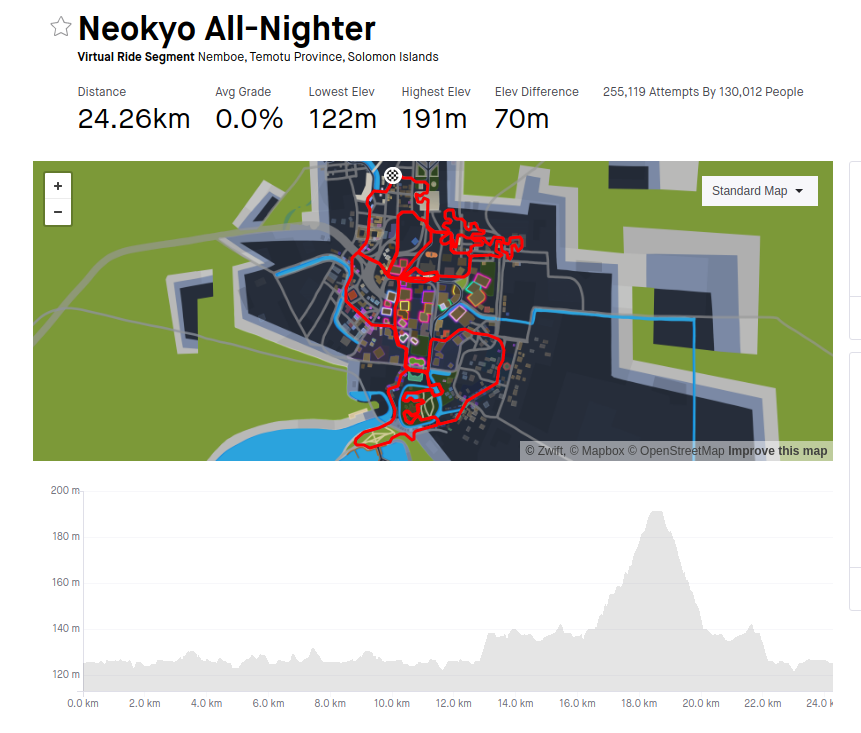

# ZwiftMap

https://zwiftmap.com

## Features

- Detailed route information
- Route search
- Mobile version
- Upcoming events
- Custom routes
- Road Surface
- Strava intergration for personal records of routes and segments
- Automatic ZwiftMap links for Strava activities
- Interactive elevation profiles
- Highlighting of all segments, sprints and KOMs
- Links to related pages of [Strava](https://strava.com), [ZwiftInsider](https://zwiftinsider.com), [ZwiftPower](https://zwiftpower.com), and [What's on Zwift](https://whatsonzwift.com)

## Screenshot

## Browser Extension for Strava

* [Chrome, Brave, Edge, and other Chromium-Browsers](https://chrome.google.com/webstore/detail/zwiftmap-for-strava/eiaekjobfimlijhpggbbkhoihlchdhdl)
* [Firefox](https://addons.mozilla.org/en-US/firefox/addon/zwiftmap/)

