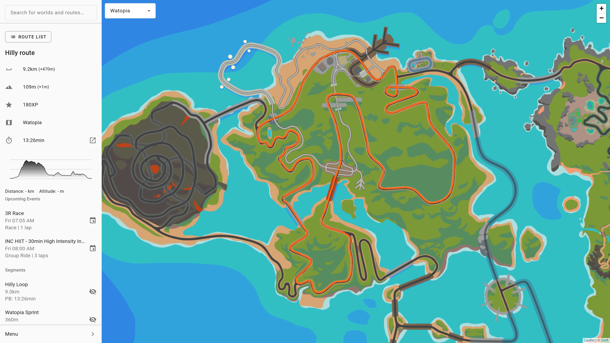
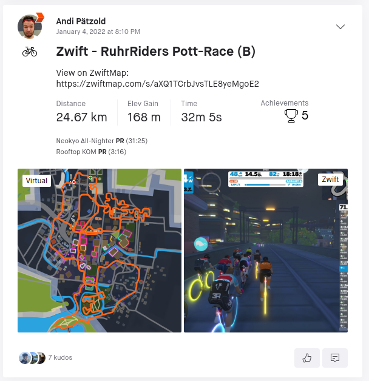
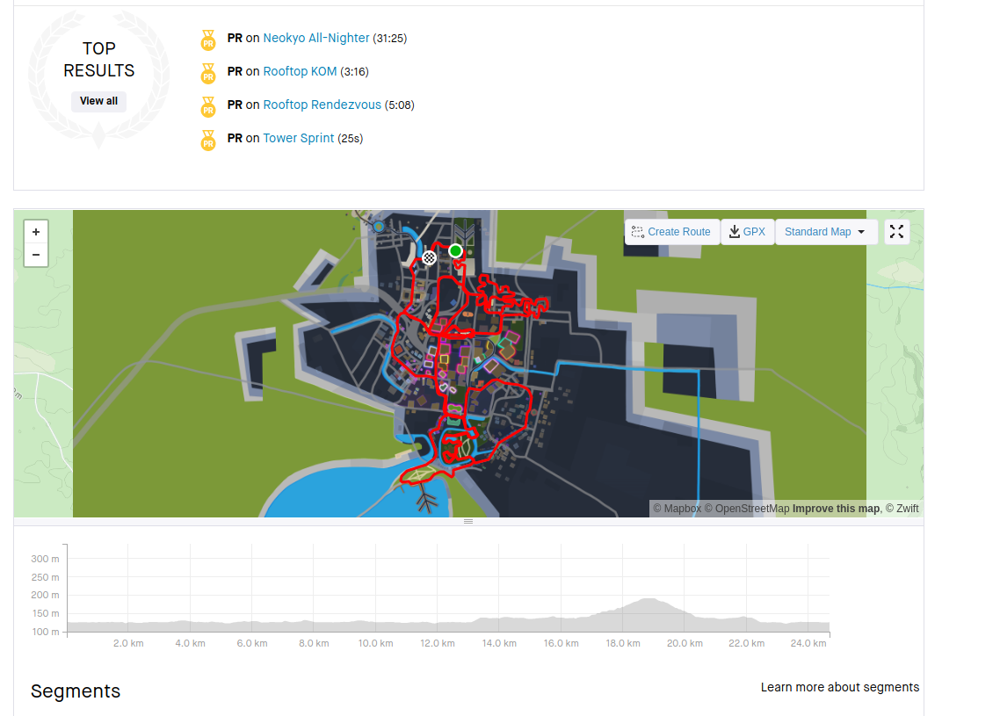
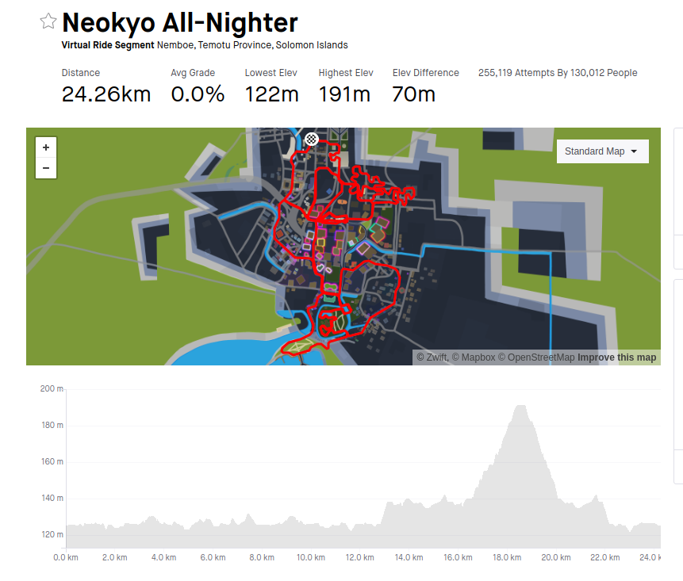

# ZwiftMap

https://zwiftmap.com

## Features

- Detailed route information
- Route search
- Mobile version
- Upcoming events
- Custom routes
- Road Surface
- Strava intergration for personal records of routes and segments
- Automatic ZwiftMap links for Strava activities
- Interactive elevation profiles
- Highlighting of all segments, sprints and KOMs
- Links to related pages of [Strava](https://strava.com), [ZwiftInsider](https://zwiftinsider.com), [ZwiftPower](https://zwiftpower.com), and [What's on Zwift](https://whatsonzwift.com)

## Screenshot

## Browser Extension for Strava

* [Chrome, Brave, Edge, and other Chromium-Browsers](https://chrome.google.com/webstore/detail/zwiftmap-for-strava/eiaekjobfimlijhpggbbkhoihlchdhdl)
* [Firefox](https://addons.mozilla.org/en-US/firefox/addon/zwiftmap/)

## Build-time route and segment streams

The frontend prebuild command `npm run prebuild:segment-streams` generates
`frontend/public/strava-segments/{stravaSegmentId}/{altitude,distance,latlng}.json`
from the published `zwift-data/streams` route and segment maps, using metadata
slugs. It rebuilds the output directory on every run and does not request streams
from Strava. Consecutive duplicate coordinates are removed with matching indices
across all three arrays, and the existing Makuri Islands altitude correction is
applied. Distance values retain the package's 0.1 m precision; rounding them to
two decimal places would not restore finer source precision.
